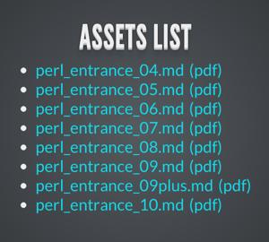

# 勉強会の資料

[Perl入学式](http://www.perl-entrance.org/)で利用した参考資料等を公開しています

## スライドの動作環境
勉強会のスライドを見るためには、Mojoliciousが動作する環境が必要です。

環境を作成するのが面倒な場合は、[Webで公開している資料](http://perl-entrance-org.github.com/)をご覧ください。

また、閲覧には、モダンなブラウザをご利用ください。

## スライドの操作方法
* 次のスライドへ移動する：スペースキー
* 全体を俯瞰する：ESCキー

カーソルキーでも動作します。

## ダウンロード
サブモジュールを使っているので、少し面倒です。

git clone したあと、サブモジュールをすべてupdateしてください。

よくわからない方は、ターミナルで適当なディレクトリを開いて、そこに以下のコードを貼り付けるとうまくいくかもしれません。

    git clone https://github.com/perl-entrance-org/workshop.git
    cd workshop
    git submodule init
    git submodule update
    cd slider_reveal
    git submodule init
    git submodule update
    cd ..
    

## スライドの起動
「slider_reveal」の中にある「md2reveal」がMojolicious::Liteで書かれたスライドの本体です。

よくわからない方は、ターミナルで上記に続けて、そこに以下のコードを貼り付けるとうまくいくかもしれません。

    cd slider_reveal
    morbo md2reveal
    

`Server available at http://127.0.0.1:3000.`というようなメッセージが出たら、ブラウザを開いて`http://localhost:3000`にアクセスしてみてください。

スライドの一覧を見ることが出来ると思います。

お好みのスライドをクリックするとスタートします。

